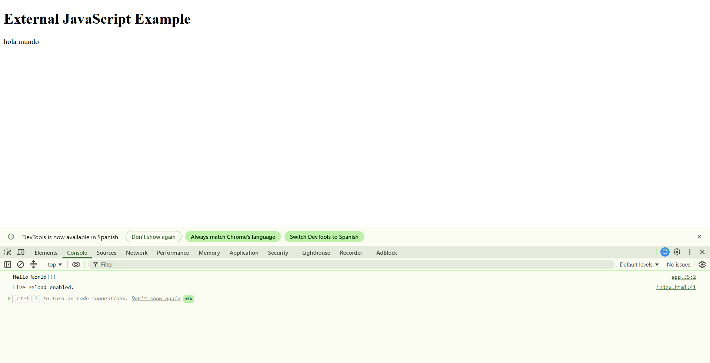

# Practice 1.1 - Installing and configuring Web Development Tools

### 2DAW - DWEC Bilingual. 

> **Mario García Oliva**:  

#### Files included in this repository:

Ennumerate and explain each one of the files included in this repo.

- **README.md** This is practice md with answered questions
- **index.html**
- **app.JS**
- **form.html**

#### Instructions: 

- Fill your name and lastname and answer the questions in the current `README.md` file. You have to submit the activity as a GitHub repo link that has to include the 

- You can add images to this tocument with the syntax:

    ```md
    
    ```

- Any other question about Markdown language you can find in the [Markdown Cheat Sheet](https://www.markdownguide.org/cheat-sheet/)

### Install and configure VSCode

1. **Install `VSCode` in your computer**.
Already installed
2. **Create a new folder called `p1.1-frontend-tools`and open it as a workspace in VSCode. Copy the current `README.md` inside it**.
3. **What functionalities do the following VSCode extensions add?**
   - **Bootstrap 5 quick Snippets**
   - **Live Server** 
   - **Prettier**
   - **Markdown All in One**
4. **Install the extensions listed in the previous point in VSCode**.
5. **What other extensions do you know that you consider interesting for developing in JavaScript**?
 "Vscode-pets" for not being alone
6. **Find in VSCode the option in `Settings` to `Format On Save` and activate it. What effect has this option?**
Format a file on save. A formatter must be available and the editor must not be shutting down. When Files: Auto Save is set to afterDelay, the file will only be formatted when saved explicitly.
### Create a Hello World in JS

7. **Create an `index.html` file inside your worspace folder.**
8. **Create the basic html structure using the `!` snippet and change the title to 'Hello World'**

    ```html
    <!DOCTYPE html>
    <html lang="en">
    <head>
      <meta charset="UTF-8">
      <meta name="viewport" content="width=device-width, initial-scale=1.0">
      <title>Hello World</title>
    </head>
    <body>
      
    </body>
    </html>
    ```

9. **Create a new file called `app.js` and add this two lines**

    ```js
    console.log("Hello Console!")
    document.body.innerHTML = "<h1>Hello document!<h1>"
    ```

10. **Import the script in your html using one of the techniques explained in class. Explain here the technique, show the code and justify why did you choose this technique**.
Im using the exxternal Javascript techniques
```html
    <!DOCTYPE html>
<html lang="en">
<head>
    <meta charset="UTF-8">
    <meta name="viewport" content="width=device-width, initial-scale=1.0">
    <title>External JavaScript Example</title>
</head>
<body>
    <h1>External JavaScript Example</h1>
    <p>hola mundo</p>

    <script src="app.JS"></script>
</body>
</html>
```
```js
alert("Hello, World!");
console.log("Hello World!!!")
```
11. **Launch `index.html` in Live Server and check that the script is running. Click right button and select inspect to show the developer tools and take a look on the console.**
    
12. **Change some message in the JS code and sava changes. You can check that Live Server refreshes the web page.**


### Create a simple form with Bootstrap 4. 

13. **At this point, we are going to create a page called `form.html` starting from the `Bs5-$` template provided by the Bootstrap extension we added. What files does this template import in the html by default?**
    ```html
    <!doctype html>
<html lang="en" data-bs-theme="light">
    <head>
        <title>Title</title>
        <!-- Required meta tags -->
        <meta charset="utf-8" />
        <meta name="viewport" content="width=device-width, initial-scale=1" />
        <!-- Bootstrap CSS v5.3.8 -->
        <link
            href="https://cdn.jsdelivr.net/npm/bootstrap@5.3.8/dist/css/bootstrap.min.css"
            rel="stylesheet"
            integrity="sha384-sRIl4kxILFvY47J16cr9ZwB07vP4J8+LH7qKQnuqkuIAvNWLzeN8tE5YBujZqJLB"
            crossorigin="anonymous"
        />
    </head>
    <body>
        <header>
            <!-- place navbar here -->
        </header>
        <main></main>
        <footer>
            <!-- place footer here -->
        </footer>
        <!-- Bootstrap JavaScript Bundle (includes Popper) -->
        <script
            src="https://cdn.jsdelivr.net/npm/bootstrap@5.3.8/dist/js/bootstrap.bundle.min.js"
            integrity="sha384-FKyoEForCGlyvwx9Hj09JcYn3nv7wiPVlz7YYwJrWVcXK/BmnVDxM+D2scQbITxI"
            crossorigin="anonymous"
        ></script>
    </body>
</html>
    ```
    
14. **Create a `<div>`with the class `.container` to wrap all the sections in the web page**
 
15. **Add a standard navigation bar inside the nav area using the `bs5-navbar-standard` snippet inside the container**
  ```html
  <body>
        <div class="container">
        <header>
            <!-- place navbar here -->
             <nav 
                class="navbar navbar-expand-sm navbar-light bg-light"
             >
                <div class="container">
                    <a class="navbar-brand" href="#">Navbar</a>
                    <button
                        class="navbar-toggler d-lg-none"
                        type="button"
                        data-bs-toggle="collapse"
                        data-bs-target="#collapsibleNavId"
                        aria-controls="collapsibleNavId"
                        aria-expanded="false"
                        aria-label="Toggle navigation"
                    >
                        <span class="navbar-toggler-icon"></span>
                    </button>
                    <div class="collapse navbar-collapse" id="collapsibleNavId">
                        <ul class="navbar-nav me-auto mt-2 mt-lg-0">
                            <li class="nav-item">
                                <a class="nav-link active" href="#" aria-current="page"
                                    >Home
                                    <span class="visually-hidden">(current)</span></a
                                >
                            </li>
                            <li class="nav-item">
                                <a class="nav-link" href="#">Link</a>
                            </li>
                            <li class="nav-item dropdown">
                                <a
                                    class="nav-link dropdown-toggle"
                                    href="#"
                                    id="dropdownId"
                                    data-bs-toggle="dropdown"
                                    aria-haspopup="true"
                                    aria-expanded="false"
                                    >Dropdown</a
                                >
                                <div
                                    class="dropdown-menu"
                                    aria-labelledby="dropdownId"
                                >
                                    <a class="dropdown-item" href="#"
                                        >Action 1</a
                                    >
                                    <a class="dropdown-item" href="#"
                                        >Action 2</a
                                    >
                                </div>
                            </li>
                        </ul>
                        <form class="d-flex my-2 my-lg-0">
                            <input
                                class="form-control me-sm-2"
                                type="text"
                                placeholder="Search"
                            />
                            <button
                                class="btn btn-outline-success my-2 my-sm-0"
                                type="submit"
                            >
                                Search
                            </button>
                        </form>
                    </div>
                </div>
             </nav>
             
        </header>
        ```
16. **Inside the main area create a form using Bootstrap to collect data from a new user who wants to register at an academy that offers courses. We can copy code from [Bootstrap Documentation](https://getbootstrap.com/docs/5.0/forms/overview/)**. 
```html
<main>
            <div class="mb-3">
            <label for="" class="form-label">Email</label>
            <input
                type="email"
                class="form-control"
                name=""
                id=""
                aria-describedby="emailHelpId"
                placeholder="abc@mail.com"
            />
            <small id="emailHelpId" class="form-text text-body-secondary">Help text</small>
        </div>
        <div class="mb-3">
            <label for="" class="form-label">Password</label>
            <input
                type="password"
                class="form-control"
                name=""
                id=""
                placeholder=""
            />
        </div>
        <div class="mb-3">
            <label for="" class="form-label">About you</label>
            <textarea class="form-control" name="" id="" rows="3"></textarea>
        </div>
        
      
            
        </main>
```
### Install Git, and upload your repository to GitHub

17. **Install [git](https://git-scm.com/) in your computer**.
    
18. **Init the git repository**
    
19. **Log in to your GitHub account provided by IES Azarquiel**
    
20. **Follow the teacher on GitHub at the following link: [https://github.com/jeatzr/](https://github.com/jeatzr/)**
    
21. **Create a new empty repository on GitHub named `p1.1-frontend-tools`.**
    
22. **Follow the instructions in the command line provided by GitHub to add your files, create the first commit and push it. Notice that in out case we have to add all files to the staged area with `git add .`, not just`git add README.md`** 
    
23. **To finish, submit the link of your GH repo to the task in our Classroom.**